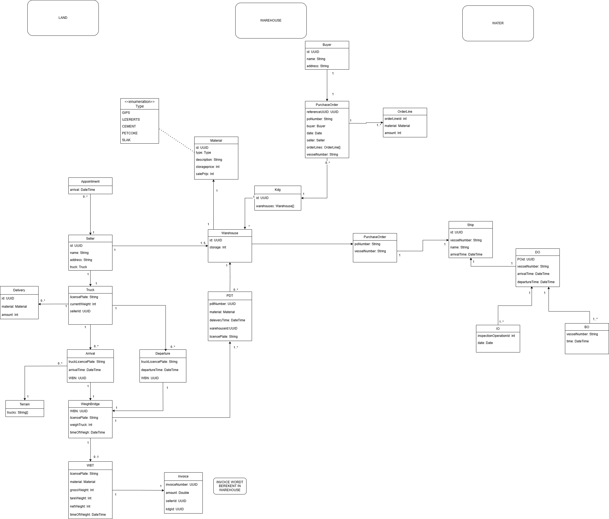

# V1 
## Pre coaching 30/09/2024
### Geschatte Progress (in %): 20%
### Status
_Waar sta je globaal? wat loopt er goed/slecht? hoe verloopt de samenwerking? Wie heeft globaal welke delen uitgewerkt_

S1: Waar sta je globaal? wat loopt er goed/slecht? hoe verloopt de samenwerking? Wie heeft globaal welke delen uitgewerkt_

Ik ben aan het werken aan landzijde en sinds ik al een basis en architectuur heb vastgelegd,
zou alles normaal vlotjes moeten verlopen.

Ik heb veel tijd verloren aan persistence gedeelte, maar ik ben blij dat die achter de rug is.

S2: Begin ging nogal wat moeilijk om de opdracht beschrijving te begrijpen.
ik ben bezig met waterzijde. Was wat moeilijk om uit te zoeken waar ik moest beginnen en zat daar vast maar ben uiteindelijk begonnen met purchaseorder te maken en
van daaruit zal ik een dokoperatie maken met een schip.

### Stories
_(Enkel voor stories die speciale aandacht vragen)_

### Quality
_Acties (refactoring,..) die nog geplant staan om de kwaliteit van project te verhogen_
_(maak hier issues voor aan!)_

### Vragen
_eventuele vragen voor je coach_

## Post coaching
### Feedback
_(invullen na gesprek)_ 
Creates moeten in service of services maken als service te groot is.
Services transactionel maken voor lazy.
Dto's vormen in create methodes in service.

# V2
## Pre coaching 21/10/2024
### Geschatte Progress (in %): 70%
### Status
_Waar sta je globaal? wat loopt er goed/slecht? hoe verloopt de samenwerking? Wie heeft globaal welke delen uitgewerkt_

Algemeen: samenwerking verloopt goed. Veel progress gemaakt. 
S1: land volledig uitgewerkt. 
S2: water volledig uitgewerkt.

### Stories
_(Enkel voor stories die speciale aandacht vragen)_

### Quality
_Acties (refactoring,..) die nog geplant staan om de kwaliteit van project te verhogen_
_(maak hier issues voor aan!)_

automatische fifo trucks verwerken om 20u.

### Vragen
_eventuele vragen voor je coach_

## Post coaching
### Feedback

# V3
## Pre coaching 04/14/2024
### Geschatte Progress (in %): 95%
### Status
_Waar sta je globaal? wat loopt er goed/slecht? hoe verloopt de samenwerking? Wie heeft globaal welke delen uitgewerkt_

Algemeen: samenwerking verloopt goed. Veel progress gemaakt.
Alles normaal gezien uitgewerkt.

### Stories
_(Enkel voor stories die speciale aandacht vragen)_

### Quality
_Acties (refactoring,..) die nog geplant staan om de kwaliteit van project te verhogen_
_(maak hier issues voor aan!)_

### Vragen
_eventuele vragen voor je coach_

## Post coaching
### Feedback

# One Pager

---
    Justin Van Leuvenum
[JustinVanLeuvenum.pdf](JustinVanLeuvenum.pdf)

    MuhammetMurat
[MuhammetMurat.pdf](MuhammetMurat.pdf)

# Domein Model
